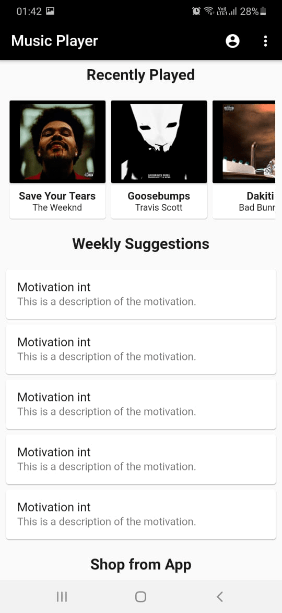
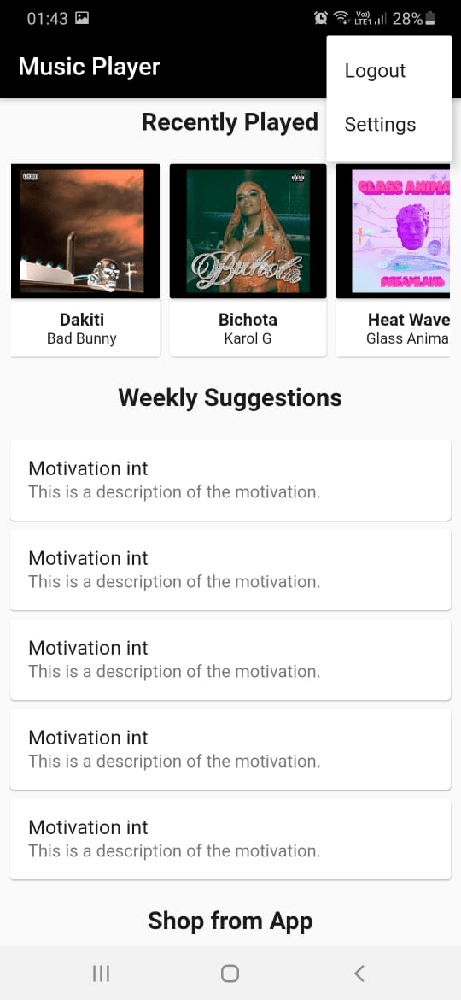
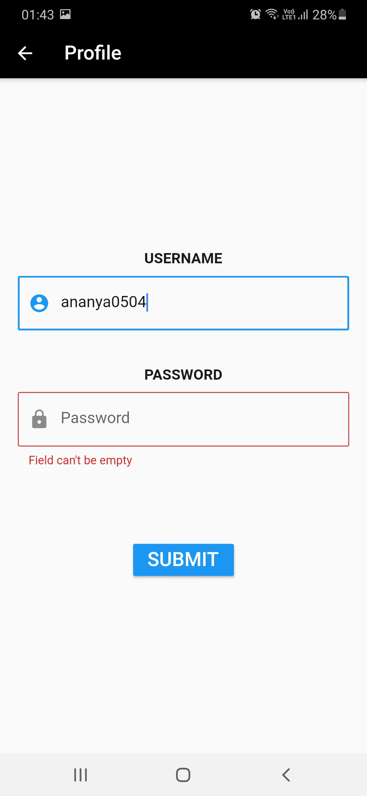

# Hello :wave:

Welcome to **Music_Player** project. 

## My motivation

This app was created as an attempt to learn Flutter with Google's 30 Days Of Flutter Challenge!

## Technology/ Stack used

- **Mobile framework**: Flutter v1.17.4

## Achievement :tada: :raised_hands:

I was able to implement all my learnings in this small app!

## Screenshots & Gif

Here are some screenshots of my work -

**Screenshots**

  
  
  

  
  
  

### If you like my work please give me a :star:, it will motivate me to do more awesome work :blush: